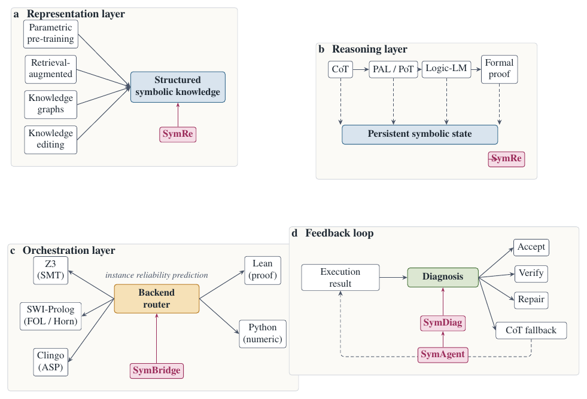

<a id="readme-top"></a>

<div align="center">

# 🧠🔣 Awesome Neuro-Symbolic Scientific Reasoning [](https://awesome.re)

**面向可信科学推理的神经符号大模型 — 论文与资源精选**

[](https://github.com/cuiwenyao/Awesome-Neuro-Symbolic-Scientific-Reasoning)
[](./CONTRIBUTING.md)
[](https://github.com/cuiwenyao/Awesome-Neuro-Symbolic-Scientific-Reasoning/stargazers)
[](https://github.com/cuiwenyao/Awesome-Neuro-Symbolic-Scientific-Reasoning/commits)
[](./LICENSE)
[](https://github.com/cuiwenyao/Awesome-Neuro-Symbolic-Scientific-Reasoning)

[**English**](./README.md) ｜ 共收录 **155+** 篇论文

</div>

---

> **本仓库**配套综述《面向可信科学推理的神经符号大模型》(*Neurosymbolic Large Language Models for Trustworthy Scientific Reasoning*)，系统整理把大模型推理从**「流畅但不可验证」**升级为**「可追踪、可诊断、可修复」**的工作。我们用一个**三层框架**组织文献：**知识注入 → 符号推理与验证 → 推理调控**，并以反馈闭环贯穿其中。

## 🗺️ 框架总览

<div align="center">

</div>

```
表示层  Representation  ──►  推理层  Reasoning  ──►  优化层  Orchestration
   知识注入            符号推理 & 验证        多后端调控
       │                          │                              │
       └──────────────  反馈闭环  Feedback · Diagnosis · Repair  ──────────────┘
```

## 📢 动态

- **2026-06** ｜ 🎉 仓库上线，首批收录 **155+** 篇论文。
- ⭐ 配套综述（神经符号科学推理）整理中，arXiv 链接即将公开。

## 📑 目录

<details open>

- [🧱 神经符号 AI 基础](#foundations)
- [📚 相关综述与立场论文](#surveys)
- [🧪 AI for Science 里程碑](#milestones)
- [🧩 第一层 — 知识注入](#l1)
  - [参数化知识与后训练](#l1-param)
  - [检索增强生成](#l1-rag)
  - [知识图谱与知识编辑](#l1-kg)
  - [可验证奖励的强化学习（RLVR）](#l1-rlvr)
- [🔣 第二层 — 符号推理与验证](#l2)
  - [思维链与推理时计算](#l2-cot)
  - [程序辅助推理](#l2-pal)
  - [逻辑辅助推理](#l2-logic)
  - [形式化定理证明](#l2-proof)
  - [持久符号表示 ⭐](#l2-symre)
  - [错误定位与可解释诊断 ⭐](#l2-diag)
- [🎛️ 第三层 — 推理调控](#l3)
  - [智能体与工具使用](#l3-agent)
  - [求解器反馈作为控制信号 ⭐](#l3-feedback)
  - [多后端路由 ⭐](#l3-backend)
  - [闭环科学发现](#l3-closed)
- [📊 基准与数据集](#bench)
- [⭐ 特别收录：本综述实证工作](#featured)
- [🤝 贡献](#contributing)
- [📌 引用](#citation)

</details>

<a id="foundations"></a>
## 🧱 神经符号 AI 基础

经典符号引擎与早期神经符号思想——它们至今仍作为验证器、求解器与推理后端支撑着大模型流水线。

| 标题 | 发表 | 年份 | 链接 |
| :-- | :-- | :--: | :-- |
| Z3: an efficient SMT solver | TACAS | 2008 | [DOI](https://doi.org/10.1007/978-3-540-78800-3_24) |
| SWI-Prolog | Theory and Practice of Logic Programming | 2012 | [DOI](https://doi.org/10.1017/S1471068411000494) |
| Multi-shot ASP solving with clingo | Theory and Practice of Logic Programming | 2019 | [DOI](https://doi.org/10.1017/S1471068418000054) |
| Distilling free-form natural laws from experimental data | Science | 2009 | [DOI](https://doi.org/10.1126/science.1165893) |

<p align="right">(<a href="#readme-top">⬆ 回到顶部</a>)</p>

<a id="surveys"></a>
## 📚 相关综述与立场论文

围绕大模型推理、幻觉、科学发现与自主智能体的综述与展望，勾勒整体图景。

| 标题 | 发表 | 年份 | 链接 |
| :-- | :-- | :--: | :-- |
| Scientific discovery in the age of artificial intelligence | Nature | 2023 | [DOI](https://doi.org/10.1038/s41586-023-06221-2) |
| Survey of hallucination in natural language generation | ACM Computing Surveys | 2023 | [DOI](https://doi.org/10.1145/3571730) |
| On scientific understanding with artificial intelligence | Nature Reviews Physics | 2022 | [DOI](https://doi.org/10.1038/s42254-022-00518-3) |
| Science in the age of large language models | Nature Reviews Physics | 2023 | [DOI](https://doi.org/10.1038/s42254-023-00581-4) |
| The impact of large language models on scientific discovery: a preliminary study using GPT-4 | arXiv | 2023 | [Scholar](https://scholar.google.com/scholar?q=The%20impact%20of%20large%20language%20models%20on%20scientific%20discovery%3A%20a%20preliminary%20study%20using%20GPT-4) |
| Sparks of artificial general intelligence: early experiments with GPT-4 | arXiv | 2023 | [Scholar](https://scholar.google.com/scholar?q=Sparks%20of%20artificial%20general%20intelligence%3A%20early%20experiments%20with%20GPT-4) |
| Transformers and large language models for chemistry and drug discovery | arXiv | 2023 | [Scholar](https://scholar.google.com/scholar?q=Transformers%20and%20large%20language%20models%20for%20chemistry%20and%20drug%20discovery) |
| Mathematical agents: A survey | arXiv | 2024 | [Scholar](https://scholar.google.com/scholar?q=Mathematical%20agents%3A%20A%20survey) |
| A survey on large language model based autonomous agents | Frontiers of Computer Science | 2024 | [DOI](https://doi.org/10.1007/s11704-024-40231-1) |
| The rise and potential of large language model based agents: a survey | Science China Information Sciences | 2025 | [DOI](https://doi.org/10.1007/s11432-024-4222-0) |
| Unifying large language models and knowledge graphs: a roadmap | IEEE Transactions on Knowledge and Data Engineering | 2024 | [DOI](https://doi.org/10.1109/TKDE.2024.3352100) |

<p align="right">(<a href="#readme-top">⬆ 回到顶部</a>)</p>

<a id="milestones"></a>
## 🧪 AI for Science 里程碑

学习与搜索、符号结构或形式验证相结合、在真实科学中跨过「答案能解」门槛的标志性系统。

| 标题 | 发表 | 年份 | 链接 |
| :-- | :-- | :--: | :-- |
| Mastering the game of Go with deep neural networks and tree search | Nature | 2016 | [DOI](https://doi.org/10.1038/nature16961) |
| Mastering the game of Go without human knowledge | Nature | 2017 | [DOI](https://doi.org/10.1038/nature24270) |
| Highly accurate protein structure prediction with AlphaFold | Nature | 2021 | [DOI](https://doi.org/10.1038/s41586-021-03819-2) |
| Accurate structure prediction of biomolecular interactions with AlphaFold 3 | Nature | 2024 | [DOI](https://doi.org/10.1038/s41586-024-07487-w) |
| Boltz-1: Open-source structure prediction at AlphaFold-3 quality | Nature Methods | 2025 | [arXiv](https://arxiv.org/abs/2411.13408) |
| Solving olympiad geometry without human demonstrations | Nature | 2024 | [DOI](https://doi.org/10.1038/s41586-023-06747-5) |
| Mathematical discoveries from program search with large language models | Nature | 2024 | [DOI](https://doi.org/10.1038/s41586-023-06924-6) |
| AlphaEvolve: a coding agent for scientific and algorithmic discovery | arXiv | 2025 | [arXiv](https://arxiv.org/abs/2506.13131) |
| Discovering faster matrix multiplication algorithms with reinforcement learning | Nature | 2022 | [DOI](https://doi.org/10.1038/s41586-022-05172-4) |
| Faster sorting algorithms discovered using deep reinforcement learning | Nature | 2023 | [DOI](https://doi.org/10.1038/s41586-023-06004-9) |
| Olympiad-level formal mathematical reasoning with reinforcement learning | Nature | 2026 | [DOI](https://doi.org/10.1038/s41586-025-09833-y) |
| Scaling deep learning for materials discovery | Nature | 2023 | [DOI](https://doi.org/10.1038/s41586-023-06735-9) |
| A generative model for inorganic materials design | Nature | 2025 | [DOI](https://doi.org/10.1038/s41586-025-08628-5) |
| Simulating 500 million years of evolution with a language model | Science | 2025 | [DOI](https://doi.org/10.1126/science.ads0018) |
| ProteinINR / sequence-to-function foundation model | Nature Methods | 2024 | [DOI](https://doi.org/10.1038/s41592-024-02373-9) |
| Autonomous chemical research with large language models | Nature | 2023 | [DOI](https://doi.org/10.1038/s41586-023-06792-0) |
| An autonomous laboratory for the accelerated synthesis of novel materials | Nature | 2023 | [DOI](https://doi.org/10.1038/s41586-023-06734-w) |
| A deep learning approach to antibiotic discovery | Cell | 2020 | [DOI](https://doi.org/10.1016/j.cell.2020.01.021) |
| Discovery of a structural class of antibiotics with explainable deep learning | Nature | 2024 | [DOI](https://doi.org/10.1038/s41586-023-06887-8) |

<p align="right">(<a href="#readme-top">⬆ 回到顶部</a>)</p>

<a id="l1"></a>
## 🧩 第一层 — 知识注入

**科学知识如何进入模型？** 从参数化记忆、检索，到知识图谱、知识编辑，再到可验证奖励的强化学习。

<p align="right">(<a href="#readme-top">⬆ 回到顶部</a>)</p>

<a id="l1-param"></a>
### 参数化知识与后训练

把领域知识承载于权重中的对齐方法与大型预训练 / 推理模型。

| 标题 | 发表 | 年份 | 链接 |
| :-- | :-- | :--: | :-- |
| Deep reinforcement learning from human preferences | NeurIPS | 2017 | [Scholar](https://scholar.google.com/scholar?q=Deep%20reinforcement%20learning%20from%20human%20preferences) |
| Training language models to follow instructions with human feedback | NeurIPS | 2022 | [Scholar](https://scholar.google.com/scholar?q=Training%20language%20models%20to%20follow%20instructions%20with%20human%20feedback) |
| The Llama 3 herd of models | arXiv | 2024 | [Scholar](https://scholar.google.com/scholar?q=The%20Llama%203%20herd%20of%20models) |
| DeepSeek-V3 Technical Report | arXiv | 2024 | [Scholar](https://scholar.google.com/scholar?q=DeepSeek-V3%20Technical%20Report) |
| Claude 4.5 Sonnet (System Card) | Anthropic Technical Report | 2025 | [Scholar](https://scholar.google.com/scholar?q=Claude%204.5%20Sonnet%20%28System%20Card%29) |

<p align="right">(<a href="#readme-top">⬆ 回到顶部</a>)</p>

<a id="l1-rag"></a>
### 检索增强生成

在推理时注入非参数化证据，覆盖长尾事实并降低幻觉。

| 标题 | 发表 | 年份 | 链接 |
| :-- | :-- | :--: | :-- |
| Retrieval-augmented generation for knowledge-intensive NLP tasks | NeurIPS | 2020 | [Scholar](https://scholar.google.com/scholar?q=Retrieval-augmented%20generation%20for%20knowledge-intensive%20NLP%20tasks) |
| REALM: retrieval-augmented language model pre-training | ICML | 2020 | [Scholar](https://scholar.google.com/scholar?q=REALM%3A%20retrieval-augmented%20language%20model%20pre-training) |
| From local to global: A graph RAG approach to query-focused summarization | arXiv | 2024 | [Scholar](https://scholar.google.com/scholar?q=From%20local%20to%20global%3A%20A%20graph%20RAG%20approach%20to%20query-focused%20summarization) |
| HippoRAG: Neurobiologically inspired long-term memory for large language models | NeurIPS | 2024 | [arXiv](https://arxiv.org/abs/2405.14831) |
| LightRAG: Simple and fast retrieval-augmented generation | arXiv | 2024 | [Scholar](https://scholar.google.com/scholar?q=LightRAG%3A%20Simple%20and%20fast%20retrieval-augmented%20generation) |
| Self-RAG: Learning to retrieve, generate, and critique through self-reflection | ICLR | 2024 | [arXiv](https://arxiv.org/abs/2310.11511) |
| When not to trust language models: investigating effectiveness of parametric and non-parametric memories | ACL | 2023 | [Scholar](https://scholar.google.com/scholar?q=When%20not%20to%20trust%20language%20models%3A%20investigating%20effectiveness%20of%20parametric%20and%20non-parametric%20memories) |

<p align="right">(<a href="#readme-top">⬆ 回到顶部</a>)</p>

<a id="l1-kg"></a>
### 知识图谱与知识编辑

结构化关系知识，以及对模型事实的精准更新。

| 标题 | 发表 | 年份 | 链接 |
| :-- | :-- | :--: | :-- |
| K-Adapter: infusing knowledge into pre-trained models with adapters | Findings ACL | 2021 | [Scholar](https://scholar.google.com/scholar?q=K-Adapter%3A%20infusing%20knowledge%20into%20pre-trained%20models%20with%20adapters) |
| QA-GNN: reasoning with language models and knowledge graphs for question answering | NAACL | 2021 | [Scholar](https://scholar.google.com/scholar?q=QA-GNN%3A%20reasoning%20with%20language%20models%20and%20knowledge%20graphs%20for%20question%20answering) |
| Think-on-Graph: Deep and responsible reasoning of large language model on knowledge graph | ICLR | 2024 | [arXiv](https://arxiv.org/abs/2307.07697) |
| Locating and editing factual associations in GPT | NeurIPS | 2022 | [Scholar](https://scholar.google.com/scholar?q=Locating%20and%20editing%20factual%20associations%20in%20GPT) |
| Mass-editing memory in a transformer | ICLR | 2023 | [Scholar](https://scholar.google.com/scholar?q=Mass-editing%20memory%20in%20a%20transformer) |
| EasyEdit: an easy-to-use knowledge editing framework for large language models | ACL | 2024 | [Scholar](https://scholar.google.com/scholar?q=EasyEdit%3A%20an%20easy-to-use%20knowledge%20editing%20framework%20for%20large%20language%20models) |
| Editing factual knowledge in language models | EMNLP | 2021 | [Scholar](https://scholar.google.com/scholar?q=Editing%20factual%20knowledge%20in%20language%20models) |
| Fast model editing at scale | ICLR | 2022 | [Scholar](https://scholar.google.com/scholar?q=Fast%20model%20editing%20at%20scale) |

<p align="right">(<a href="#readme-top">⬆ 回到顶部</a>)</p>

<a id="l1-rlvr"></a>
### 可验证奖励的强化学习（RLVR）

以程序判题、单元测试与数学/形式验证器作为推理的客观奖励信号——近期推理模型的核心。见 **Box 1**。

| 标题 | 发表 | 年份 | 链接 |
| :-- | :-- | :--: | :-- |
| DeepSeekMath: pushing the limits of mathematical reasoning in open language models | arXiv | 2024 | [arXiv](https://arxiv.org/abs/2402.03300) |
| DeepSeek-R1: incentivizing reasoning capability in LLMs via reinforcement learning | arXiv | 2025 | [arXiv](https://arxiv.org/abs/2501.12948) |
| Learning to reason with LLMs (o1 system card) | OpenAI Technical Report | 2024 | [Scholar](https://scholar.google.com/scholar?q=Learning%20to%20reason%20with%20LLMs%20%28o1%20system%20card%29) |
| OpenAI o3-mini System Card | OpenAI Technical Report | 2025 | [Scholar](https://scholar.google.com/scholar?q=OpenAI%20o3-mini%20System%20Card) |
| Kimi K1.5: Scaling reinforcement learning with LLMs | arXiv | 2025 | [Scholar](https://scholar.google.com/scholar?q=Kimi%20K1.5%3A%20Scaling%20reinforcement%20learning%20with%20LLMs) |
| Qwen2.5-Math: Toward mathematical expert model | arXiv | 2024 | [Scholar](https://scholar.google.com/scholar?q=Qwen2.5-Math%3A%20Toward%20mathematical%20expert%20model) |
| Qwen-QwQ-32B-Preview | Alibaba Technical Report | 2024 | [Scholar](https://scholar.google.com/scholar?q=Qwen-QwQ-32B-Preview) |
| Training verifiers to solve math word problems | arXiv | 2021 | [arXiv](https://arxiv.org/abs/2110.14168) |
| Solving math word problems with process- and outcome-based feedback | arXiv | 2022 | [arXiv](https://arxiv.org/abs/2211.14275) |
| Let's verify step by step | ICLR | 2024 | [Scholar](https://scholar.google.com/scholar?q=Let%27s%20verify%20step%20by%20step) |
| Math-Shepherd: Verify and reinforce LLMs step-by-step without human annotations | ACL | 2024 | [arXiv](https://arxiv.org/abs/2312.08935) |
| Improve mathematical reasoning in language models by automated process supervision | arXiv | 2024 | [Scholar](https://scholar.google.com/scholar?q=Improve%20mathematical%20reasoning%20in%20language%20models%20by%20automated%20process%20supervision) |
| ReFT: Reasoning with reinforced fine-tuning | ACL | 2024 | [arXiv](https://arxiv.org/abs/2401.08967) |
| STaR: bootstrapping reasoning with reasoning | NeurIPS | 2022 | [Scholar](https://scholar.google.com/scholar?q=STaR%3A%20bootstrapping%20reasoning%20with%20reasoning) |
| Quiet-STaR: Language models can teach themselves to think before speaking | COLM | 2024 | [arXiv](https://arxiv.org/abs/2403.09629) |
| V-STaR: Training verifiers for self-taught reasoners | COLM | 2024 | [arXiv](https://arxiv.org/abs/2402.06457) |
| OVM, outcome-supervised value models for planning in mathematical reasoning | Findings NAACL | 2024 | [arXiv](https://arxiv.org/abs/2311.09724) |
| RL on incorrect synthetic data scales the efficiency of LLM math reasoning by eight-fold | NeurIPS | 2024 | [arXiv](https://arxiv.org/abs/2406.14532) |
| Self-rewarding language models | ICML | 2024 | [arXiv](https://arxiv.org/abs/2401.10020) |

<p align="right">(<a href="#readme-top">⬆ 回到顶部</a>)</p>

<a id="l2"></a>
## 🔣 第二层 — 符号推理与验证

**推理如何变成可执行、可核查的对象？** 从思维链，到程序/逻辑辅助推理、形式证明、持久符号状态与可解释诊断。

<p align="right">(<a href="#readme-top">⬆ 回到顶部</a>)</p>

<a id="l2-cot"></a>
### 思维链与推理时计算

自然语言推理链及其树状 / 图状 / 自我改写 / 推理时计算的扩展。

| 标题 | 发表 | 年份 | 链接 |
| :-- | :-- | :--: | :-- |
| Chain-of-thought prompting elicits reasoning in large language models | NeurIPS | 2022 | [Scholar](https://scholar.google.com/scholar?q=Chain-of-thought%20prompting%20elicits%20reasoning%20in%20large%20language%20models) |
| Large language models are zero-shot reasoners | NeurIPS | 2022 | [Scholar](https://scholar.google.com/scholar?q=Large%20language%20models%20are%20zero-shot%20reasoners) |
| Self-consistency improves chain of thought reasoning in language models | ICLR | 2023 | [Scholar](https://scholar.google.com/scholar?q=Self-consistency%20improves%20chain%20of%20thought%20reasoning%20in%20language%20models) |
| Tree of thoughts: deliberate problem solving with large language models | NeurIPS | 2023 | [Scholar](https://scholar.google.com/scholar?q=Tree%20of%20thoughts%3A%20deliberate%20problem%20solving%20with%20large%20language%20models) |
| Graph of thoughts: solving elaborate problems with large language models | AAAI | 2024 | [Scholar](https://scholar.google.com/scholar?q=Graph%20of%20thoughts%3A%20solving%20elaborate%20problems%20with%20large%20language%20models) |
| Least-to-most prompting enables complex reasoning in large language models | ICLR | 2023 | [Scholar](https://scholar.google.com/scholar?q=Least-to-most%20prompting%20enables%20complex%20reasoning%20in%20large%20language%20models) |
| Self-Refine: iterative refinement with self-feedback | NeurIPS | 2023 | [Scholar](https://scholar.google.com/scholar?q=Self-Refine%3A%20iterative%20refinement%20with%20self-feedback) |
| Selection-inference: exploiting large language models for interpretable logical reasoning | ICLR | 2023 | [Scholar](https://scholar.google.com/scholar?q=Selection-inference%3A%20exploiting%20large%20language%20models%20for%20interpretable%20logical%20reasoning) |
| Scaling LLM test-time compute optimally can be more effective than scaling model parameters | arXiv | 2024 | [Scholar](https://scholar.google.com/scholar?q=Scaling%20LLM%20test-time%20compute%20optimally%20can%20be%20more%20effective%20than%20scaling%20model%20parameters) |
| Large language monkeys: Scaling inference compute with repeated sampling | arXiv | 2024 | [Scholar](https://scholar.google.com/scholar?q=Large%20language%20monkeys%3A%20Scaling%20inference%20compute%20with%20repeated%20sampling) |

<p align="right">(<a href="#readme-top">⬆ 回到顶部</a>)</p>

<a id="l2-pal"></a>
### 程序辅助推理

把计算委托给 Python / 代码解释器，使算术与算法步骤被执行而非叙述。

| 标题 | 发表 | 年份 | 链接 |
| :-- | :-- | :--: | :-- |
| PAL: program-aided language models | ICML | 2023 | [Scholar](https://scholar.google.com/scholar?q=PAL%3A%20program-aided%20language%20models) |
| Program of thoughts prompting: disentangling computation from reasoning for numerical reasoning tasks | TMLR | 2023 | [Scholar](https://scholar.google.com/scholar?q=Program%20of%20thoughts%20prompting%3A%20disentangling%20computation%20from%20reasoning%20for%20numerical%20reasoning%20tasks) |
| Code Llama: Open foundation models for code | arXiv | 2023 | [Scholar](https://scholar.google.com/scholar?q=Code%20Llama%3A%20Open%20foundation%20models%20for%20code) |
| A neural network solves, explains, and generates university math problems by program synthesis and few-shot learning at human level | National Academy of Sciences | 2022 | [DOI](https://doi.org/10.1073/pnas.2123433119) |
| Can large language models reason about program invariants? | ICML | 2023 | [Scholar](https://scholar.google.com/scholar?q=Can%20large%20language%20models%20reason%20about%20program%20invariants%3F) |
| Do PAL outputs verify what they claim? An empirical study | ACL Workshop on Natural Language Reasoning | 2024 | [Scholar](https://scholar.google.com/scholar?q=Do%20PAL%20outputs%20verify%20what%20they%20claim%3F%20An%20empirical%20study) |

<p align="right">(<a href="#readme-top">⬆ 回到顶部</a>)</p>

<a id="l2-logic"></a>
### 逻辑辅助推理

把逻辑结论委托给 SMT 求解器、一阶逻辑证明器与答案集程序，实现忠实推理。

| 标题 | 发表 | 年份 | 链接 |
| :-- | :-- | :--: | :-- |
| Logic-LM: empowering large language models with symbolic solvers for faithful logical reasoning | Findings EMNLP | 2023 | [Scholar](https://scholar.google.com/scholar?q=Logic-LM%3A%20empowering%20large%20language%20models%20with%20symbolic%20solvers%20for%20faithful%20logical%20reasoning) |
| LINC: a neurosymbolic approach for logical reasoning by combining language models with first-order logic provers | EMNLP | 2023 | [Scholar](https://scholar.google.com/scholar?q=LINC%3A%20a%20neurosymbolic%20approach%20for%20logical%20reasoning%20by%20combining%20language%20models%20with%20first-order%20logic%20provers) |
| SatLM: satisfiability-aided language models using declarative prompting | NeurIPS | 2023 | [Scholar](https://scholar.google.com/scholar?q=SatLM%3A%20satisfiability-aided%20language%20models%20using%20declarative%20prompting) |
| Faithful chain-of-thought reasoning | arXiv | 2023 | [arXiv](https://arxiv.org/abs/2301.13379) |
| SymbCoT: boosting language model based logical reasoning with symbolic chain-of-thought | arXiv | 2023 | [arXiv](https://arxiv.org/abs/2305.13160) |
| ProofWriter: generating implications, proofs, and abductive statements over natural language | Findings ACL | 2021 | [Scholar](https://scholar.google.com/scholar?q=ProofWriter%3A%20generating%20implications%2C%20proofs%2C%20and%20abductive%20statements%20over%20natural%20language) |

<p align="right">(<a href="#readme-top">⬆ 回到顶部</a>)</p>

<a id="l2-proof"></a>
### 形式化定理证明

将神经搜索与证明助手（Lean、Isabelle）结合，达到奥赛级形式化数学。

| 标题 | 发表 | 年份 | 链接 |
| :-- | :-- | :--: | :-- |
| Generative language modeling for automated theorem proving | arXiv | 2020 | [arXiv](https://arxiv.org/abs/2009.03393) |
| Thor: wielding hammers to integrate language models and automated theorem provers | NeurIPS | 2022 | [Scholar](https://scholar.google.com/scholar?q=Thor%3A%20wielding%20hammers%20to%20integrate%20language%20models%20and%20automated%20theorem%20provers) |
| NaturalProver: Grounded mathematical proof generation with language models | NeurIPS | 2022 | [arXiv](https://arxiv.org/abs/2205.12910) |
| Llemma: An open language model for mathematics | ICLR | 2024 | [arXiv](https://arxiv.org/abs/2310.10631) |
| LeanDojo: Theorem proving with retrieval-augmented language models | NeurIPS | 2023 | [arXiv](https://arxiv.org/abs/2306.15626) |
| Towards large language models as copilots for theorem proving in Lean | ICML | 2024 | [arXiv](https://arxiv.org/abs/2404.12534) |
| Baldur: Whole-proof generation and repair with large language models | FSE | 2023 | [DOI](https://doi.org/10.1145/3611643.3616243) |
| DeepSeek-Prover-V1.5 | arXiv | 2024 | [Scholar](https://scholar.google.com/scholar?q=DeepSeek-Prover-V1.5) |
| DeepSeek-Prover-V2: Advancing formal mathematical reasoning via reinforcement learning for subgoal decomposition | arXiv | 2025 | [Scholar](https://scholar.google.com/scholar?q=DeepSeek-Prover-V2%3A%20Advancing%20formal%20mathematical%20reasoning%20via%20reinforcement%20learning%20for%20subgoal%20decomposition) |
| Goedel-Prover: A frontier model for open-source automated theorem proving | arXiv | 2025 | [Scholar](https://scholar.google.com/scholar?q=Goedel-Prover%3A%20A%20frontier%20model%20for%20open-source%20automated%20theorem%20proving) |
| Kimina-Prover-Preview | Moonshot AI Technical Report | 2025 | [Scholar](https://scholar.google.com/scholar?q=Kimina-Prover-Preview) |
| AlphaGeometry2: Olympiad-level geometry problem-solving | arXiv | 2025 | [Scholar](https://scholar.google.com/scholar?q=AlphaGeometry2%3A%20Olympiad-level%20geometry%20problem-solving) |

<p align="right">(<a href="#readme-top">⬆ 回到顶部</a>)</p>

<a id="l2-symre"></a>
### 持久符号表示 ⭐

把视觉 / 科学证据抽取为持久化、类型化、带来源标注的符号事实，使推理不依赖易漂移的自然语言记忆。

| 标题 | 发表 | 年份 | 链接 |
| :-- | :-- | :--: | :-- |
| ⭐ Symbolic Representations for Multimodal Logical Reasoning | ACM MM | 2026 | _forthcoming_ |

<p align="right">(<a href="#readme-top">⬆ 回到顶部</a>)</p>

<a id="l2-diag"></a>
### 错误定位与可解释诊断 ⭐

超越标量过程奖励与模糊的 LLM 评判：用反例指出「哪一步违反了哪条前提」。见 **Box 2**。

| 标题 | 发表 | 年份 | 链接 |
| :-- | :-- | :--: | :-- |
| ⭐ SymDiag: Explainable Diagnosis for LLM Reasoning via Neuro-Symbolic Verification | KDD | 2026 | _forthcoming_ |
| Judging LLM-as-a-judge with MT-Bench and Chatbot Arena | NeurIPS | 2023 | [Scholar](https://scholar.google.com/scholar?q=Judging%20LLM-as-a-judge%20with%20MT-Bench%20and%20Chatbot%20Arena) |
| LLMs cannot find reasoning errors, but can correct them given the error location | Findings ACL | 2024 | [Scholar](https://scholar.google.com/scholar?q=LLMs%20cannot%20find%20reasoning%20errors%2C%20but%20can%20correct%20them%20given%20the%20error%20location) |
| Measuring and narrowing the compositionality gap in language models | Findings EMNLP | 2023 | [Scholar](https://scholar.google.com/scholar?q=Measuring%20and%20narrowing%20the%20compositionality%20gap%20in%20language%20models) |
| Teaching language models to self-improve via interactive demonstrations | NAACL | 2024 | [arXiv](https://arxiv.org/abs/2310.13522) |

<p align="right">(<a href="#readme-top">⬆ 回到顶部</a>)</p>

<a id="l3"></a>
## 🎛️ 第三层 — 推理调控

**系统如何选择推理路径与符号后端，并把执行反馈转化为下一步？** 智能体、求解器反馈控制、多后端路由与闭环科学。

<p align="right">(<a href="#readme-top">⬆ 回到顶部</a>)</p>

<a id="l3-agent"></a>
### 智能体与工具使用

「规划—执行—反思」范式：工具增强的大模型与多智能体框架。

| 标题 | 发表 | 年份 | 链接 |
| :-- | :-- | :--: | :-- |
| MRKL systems: a modular neuro-symbolic architecture that combines large language models, external knowledge sources and discrete reasoning | arXiv | 2022 | [arXiv](https://arxiv.org/abs/2205.00445) |
| ReAct: synergizing reasoning and acting in language models | ICLR | 2023 | [Scholar](https://scholar.google.com/scholar?q=ReAct%3A%20synergizing%20reasoning%20and%20acting%20in%20language%20models) |
| Toolformer: language models can teach themselves to use tools | NeurIPS | 2023 | [Scholar](https://scholar.google.com/scholar?q=Toolformer%3A%20language%20models%20can%20teach%20themselves%20to%20use%20tools) |
| Reflexion: language agents with verbal reinforcement learning | NeurIPS | 2023 | [Scholar](https://scholar.google.com/scholar?q=Reflexion%3A%20language%20agents%20with%20verbal%20reinforcement%20learning) |
| Chameleon: plug-and-play compositional reasoning with large language models | NeurIPS | 2023 | [Scholar](https://scholar.google.com/scholar?q=Chameleon%3A%20plug-and-play%20compositional%20reasoning%20with%20large%20language%20models) |
| HuggingGPT: solving AI tasks with ChatGPT and its friends in Hugging Face | NeurIPS | 2023 | [Scholar](https://scholar.google.com/scholar?q=HuggingGPT%3A%20solving%20AI%20tasks%20with%20ChatGPT%20and%20its%20friends%20in%20Hugging%20Face) |
| Generative agents: interactive simulacra of human behavior | Annual ACM Symposium on User Interface Software and Technology | 2023 | [DOI](https://doi.org/10.1145/3586183.3606763) |
| Voyager: an open-ended embodied agent with large language models | TMLR | 2024 | [Scholar](https://scholar.google.com/scholar?q=Voyager%3A%20an%20open-ended%20embodied%20agent%20with%20large%20language%20models) |
| AutoGen: Enabling next-gen LLM applications via multi-agent conversation | COLM | 2024 | [arXiv](https://arxiv.org/abs/2308.08155) |
| MetaGPT: Meta programming for a multi-agent collaborative framework | ICLR | 2024 | [arXiv](https://arxiv.org/abs/2308.00352) |
| SWE-agent: Agent-computer interfaces enable automated software engineering | NeurIPS | 2024 | [arXiv](https://arxiv.org/abs/2405.15793) |
| Multi-agent collaboration: Harnessing the power of intelligent LLM agents | arXiv | 2023 | [Scholar](https://scholar.google.com/scholar?q=Multi-agent%20collaboration%3A%20Harnessing%20the%20power%20of%20intelligent%20LLM%20agents) |

<p align="right">(<a href="#readme-top">⬆ 回到顶部</a>)</p>

<a id="l3-feedback"></a>
### 求解器反馈作为控制信号 ⭐

把求解器执行轨迹编码为结构化反馈，驱动 接受 / 验证 / 修复 / 回退 决策——而不仅是布尔判定。

| 标题 | 发表 | 年份 | 链接 |
| :-- | :-- | :--: | :-- |
| ⭐ Beyond Verification: Solver Feedback as Control in Neuro-Symbolic Reasoning | EMNLP | 2026 | _forthcoming_ |

<p align="right">(<a href="#readme-top">⬆ 回到顶部</a>)</p>

<a id="l3-backend"></a>
### 多后端路由 ⭐

不同符号后端（Z3、Prolog、Clingo、Lean、Python）擅长不同任务类别；实例级路由聚合其互补优势。

| 标题 | 发表 | 年份 | 链接 |
| :-- | :-- | :--: | :-- |
| ⭐ Unveiling the Multi-Backend Complementarity in Neuro-Symbolic | EMNLP | 2026 | _forthcoming_ |

<p align="right">(<a href="#readme-top">⬆ 回到顶部</a>)</p>

<a id="l3-closed"></a>
### 闭环科学发现

在模型推理、符号约束与物理实验之间形成闭环的工具增强智能体与机器人平台。

| 标题 | 发表 | 年份 | 链接 |
| :-- | :-- | :--: | :-- |
| Augmenting large language models with chemistry tools | Nature Machine Intelligence | 2024 | [DOI](https://doi.org/10.1038/s42256-024-00832-8) |
| Large language models for scientific discovery in molecular property prediction | Nature Machine Intelligence | 2025 | [DOI](https://doi.org/10.1038/s42256-025-00994-z) |
| Leveraging large language models for predictive chemistry | Nature Machine Intelligence | 2024 | [DOI](https://doi.org/10.1038/s42256-023-00788-1) |
| Planning chemical syntheses with deep neural networks and symbolic AI | Nature | 2018 | [DOI](https://doi.org/10.1038/nature25978) |
| Molecular transformer: a model for uncertainty-calibrated chemical reaction prediction | ACS Central Science | 2019 | [DOI](https://doi.org/10.1021/acscentsci.9b00576) |
| MoleculeNet: a benchmark for molecular machine learning | Chemical Science | 2018 | [DOI](https://doi.org/10.1039/C7SC02664A) |
| Molecular contrastive learning of representations via graph neural networks | Nature Machine Intelligence | 2022 | [DOI](https://doi.org/10.1038/s42256-022-00447-x) |
| Uni-Mol: a universal 3D molecular representation learning framework | ICLR | 2023 | [Scholar](https://scholar.google.com/scholar?q=Uni-Mol%3A%20a%20universal%203D%20molecular%20representation%20learning%20framework) |
| A robotic platform for flow synthesis of organic compounds informed by AI planning | Science | 2019 | [DOI](https://doi.org/10.1126/science.aax1566) |
| Controlling an organic synthesis robot with machine learning to search for new reactivity | Nature | 2018 | [DOI](https://doi.org/10.1038/s41586-018-0307-8) |
| A mobile robotic chemist | Nature | 2020 | [DOI](https://doi.org/10.1038/s41586-020-2442-2) |
| Bayesian reaction optimization as a tool for chemical synthesis | Nature | 2021 | [DOI](https://doi.org/10.1038/s41586-021-03213-y) |
| Predicting reaction performance in C-N cross-coupling using machine learning | Science | 2018 | [DOI](https://doi.org/10.1126/science.aar5169) |
| Machine-learning-assisted materials discovery using failed experiments | Nature | 2016 | [DOI](https://doi.org/10.1038/nature17439) |

<p align="right">(<a href="#readme-top">⬆ 回到顶部</a>)</p>

<a id="bench"></a>
## 📊 基准与数据集

面向科学、数学、逻辑、多模态与智能体推理的评测基准。

| 标题 | 发表 | 年份 | 链接 |
| :-- | :-- | :--: | :-- |
| Learn to explain: multimodal reasoning via thought chains for science question answering | NeurIPS | 2022 | [Scholar](https://scholar.google.com/scholar?q=Learn%20to%20explain%3A%20multimodal%20reasoning%20via%20thought%20chains%20for%20science%20question%20answering) |
| MMMU: a massive multi-discipline multimodal understanding and reasoning benchmark for expert AGI | CVPR | 2024 | [Scholar](https://scholar.google.com/scholar?q=MMMU%3A%20a%20massive%20multi-discipline%20multimodal%20understanding%20and%20reasoning%20benchmark%20for%20expert%20AGI) |
| MMMU-Pro: A more robust multi-discipline multimodal understanding benchmark | arXiv | 2024 | [Scholar](https://scholar.google.com/scholar?q=MMMU-Pro%3A%20A%20more%20robust%20multi-discipline%20multimodal%20understanding%20benchmark) |
| MathVista: evaluating mathematical reasoning of foundation models in visual contexts | ICLR | 2024 | [Scholar](https://scholar.google.com/scholar?q=MathVista%3A%20evaluating%20mathematical%20reasoning%20of%20foundation%20models%20in%20visual%20contexts) |
| MathVerse: Does your multi-modal LLM truly see the diagrams in visual math problems? | ECCV | 2024 | [arXiv](https://arxiv.org/abs/2403.14624) |
| LogicVista: multimodal LLM logical reasoning benchmark in visual contexts | arXiv | 2024 | [arXiv](https://arxiv.org/abs/2407.04973) |
| Measuring mathematical problem solving with the MATH dataset | NeurIPS | 2021 | [Scholar](https://scholar.google.com/scholar?q=Measuring%20mathematical%20problem%20solving%20with%20the%20MATH%20dataset) |
| Challenging BIG-Bench tasks and whether chain-of-thought can solve them | Findings ACL | 2023 | [Scholar](https://scholar.google.com/scholar?q=Challenging%20BIG-Bench%20tasks%20and%20whether%20chain-of-thought%20can%20solve%20them) |
| LogicBench: towards systematic evaluation of logical reasoning ability of large language models | ACL | 2024 | [Scholar](https://scholar.google.com/scholar?q=LogicBench%3A%20towards%20systematic%20evaluation%20of%20logical%20reasoning%20ability%20of%20large%20language%20models) |
| OlympiadBench: A challenging benchmark for promoting AGI with olympiad-level bilingual multimodal scientific problems | ACL | 2024 | [arXiv](https://arxiv.org/abs/2402.14008) |
| SciBench: Evaluating college-level scientific problem-solving abilities of large language models | ICML | 2024 | [arXiv](https://arxiv.org/abs/2307.10635) |
| ScienceAgentBench: Toward rigorous assessment of language agents for data-driven scientific discovery | ICLR | 2025 | [arXiv](https://arxiv.org/abs/2410.05080) |
| AgentBench: Evaluating LLMs as agents | ICLR | 2024 | [arXiv](https://arxiv.org/abs/2308.03688) |
| BOLAA: Benchmarking and orchestrating LLM-augmented autonomous agents | arXiv | 2023 | [Scholar](https://scholar.google.com/scholar?q=BOLAA%3A%20Benchmarking%20and%20orchestrating%20LLM-augmented%20autonomous%20agents) |

<p align="right">(<a href="#readme-top">⬆ 回到顶部</a>)</p>

<a id="featured"></a>
## ⭐ 特别收录：本综述实证工作

四篇工作分别支撑三层框架中的一条关键论点，构成「诊断—修复」矩阵：

| # | 系统 | 一句话贡献 | 关键结果 | 发表 |
| :-: | :-- | :-- | :-- | :-- |
| P1 | **SymAgent** | 把求解器反馈编码为结构化控制信号，动态决策 接受/验证/修复/回退 | MBR-1200 上较 CoT+LM **+13.0pp**，仅 0.36 次符号调用/题 | EMNLP'26 |
| P2 | **SymRe** | 持久化、类型化、带来源的符号表示，克服多模态视觉证据衰退 | MusLR/LogiCAM 扩展上较 LogiCAM **+22.3pp** | ACM MM'26 |
| P3 | **SymDiag** | 两阶段神经符号验证，输出反例/矛盾/缺失前提级诊断 | 可区分「翻译失真」与「推理缺陷」，支持多轮纠正 | KDD'26 |
| P4 | **SymBridge** | 实例级后端可靠性预测下的多后端动态路由 | 1479×7 基准上较 CoT **+6.9pp**，难题集 **+15.5pp** | EMNLP'26 |

<p align="right">(<a href="#readme-top">⬆ 回到顶部</a>)</p>

<a id="contributing"></a>
## 🤝 贡献

欢迎补充遗漏的论文、代码与基准！请阅读 [CONTRIBUTING.md](./CONTRIBUTING.md)，按表格条目格式提交 Pull Request。

<a id="citation"></a>
## 📌 引用

若本仓库对你的研究有帮助，请引用配套综述（即将公开）：

```bibtex
@misc{cui2026neurosymbolic,
  title  = {Neurosymbolic Large Language Models for Trustworthy Scientific Reasoning: A Survey of Knowledge Injection, Explainable Verification, and Dynamic Control},
  author = {Cui, Wenyao},
  year   = {2026},
  note   = {Manuscript in preparation}
}
```

## ⭐ Star History

<a href="https://star-history.com/#cuiwenyao/Awesome-Neuro-Symbolic-Scientific-Reasoning&Date">
  
</a>

## 📜 许可

本仓库内容（论文整理、说明文字）以 [CC BY 4.0](./LICENSE) 许可发布。所列论文版权归各自作者与出版方所有。
